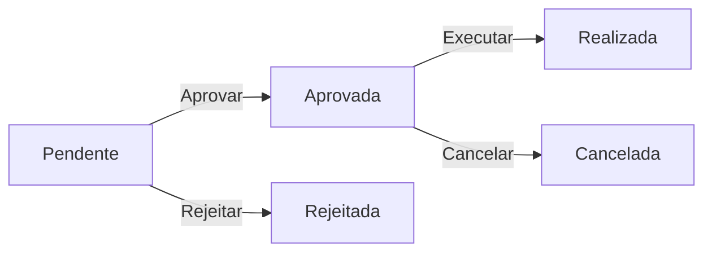

# Sistema de Permutas - Guia Completo

## 📋 Índice
1. [Visão Geral](#visão-geral)
2. [Tipos de Permuta](#tipos-de-permuta)
3. [Processo de Criação](#processo-de-criação)
4. [Sistema de Créditos](#sistema-de-créditos)
5. [Validações](#validações)
6. [Estados da Permuta](#estados-da-permuta)
7. [Fluxo Técnico](#fluxo-técnico)

---

## 🎯 Visão Geral

O **Sistema de Permutas** permite que professores troquem ou reponham aulas de forma organizada e controlada. Existem dois tipos principais de permuta:

- **Permuta Normal**: Troca de aula com reposição em data e local específicos
- **Permuta com Crédito**: Reposição de aula utilizando créditos de visitas de estudo

---

## 📊 Tipos de Permuta

### 1. Permuta Normal

Quando o professor precisa faltar a uma aula e irá repô-la em outra data/horário.

**Campos Obrigatórios:**
- Data em que irá faltar
- Data de reposição
- Bloco horário de reposição
- Sala de reposição
- Professor substituto

**Processo:**
1. Professor seleciona a aula a permutar
2. Escolhe a data em que irá faltar (mesmo dia da semana)
3. Define data e horário de reposição
4. Seleciona sala disponível
5. Indica professor substituto (pode ser ele próprio)
6. Pode agrupar múltiplas aulas do mesmo dia/turma

### 2. Permuta com Crédito

Quando o professor utiliza créditos de visitas de estudo para repor aulas.

**Características:**
- Não requer bloco horário nem sala (aula foi dada na visita)
- Créditos são automaticamente atribuídos quando há visitas de estudo
- Um crédito = uma aula reposta
- Créditos devem corresponder ao turno da aula

**Processo:**
1. Professor seleciona a aula a permutar
2. Marca um ou mais créditos disponíveis
3. Sistema preenche automaticamente:
   - Data de reposição = data da visita de estudo
   - Sala = "VE" (Visita de Estudo)
   - Bloco = "0" (visita de estudo)
   - Professor substituto = próprio professor
4. Pode usar múltiplos créditos para múltiplas aulas

---

## 🔄 Processo de Criação

### Passo 1: Seleção da Aula
- Professor acede ao seu horário
- Clica em "Pedir Permuta" na aula desejada
- Sistema exibe informações da aula (disciplina, turma, horário)

### Passo 2: Verificação de Créditos
Se houver créditos disponíveis:
- ✅ Sistema exibe alerta verde com créditos disponíveis
- ✅ Créditos são filtrados por:
  - Professor (NIF)
  - Turma
  - Disciplina
  - Estado (apenas "disponível")
  - Turno (se aplicável)

### Passo 3: Escolha do Tipo de Permuta

#### Opção A: Usar Créditos
1. Marcar checkbox(es) do(s) crédito(s) desejado(s)
2. Campos de bloco e sala ficam ocultos (não necessários)
3. Validação automática de créditos necessários
4. Filtro de aulas adicionais por turno

#### Opção B: Permuta Normal
1. Preencher data em que irá faltar
2. Selecionar data de reposição
3. Escolher bloco horário disponível
4. Selecionar sala livre no horário
5. Indicar professor substituto

### Passo 4: Aulas Adicionais (Opcional)
- Marcar outras aulas do mesmo dia e turma
- **Regra Importante**: Apenas aulas do mesmo turno são exibidas
- Com créditos: cada aula adicional consome um crédito extra

### Passo 5: Submissão
- Validação frontend e backend
- Criação de grupo de permutas (se múltiplas aulas)
- Consumo de créditos (se aplicável)
- Notificações por email
- Estado inicial: "Pendente"

---

## 💳 Sistema de Créditos

### O que são Créditos?

Créditos são aulas que foram dadas durante **visitas de estudo** e que dão direito a faltar em datas futuras sem necessidade de reposição física.

### Criação de Créditos

Os créditos são criados automaticamente quando:
1. Há uma visita de estudo registada no sistema
2. O sistema identifica aulas que ocorrem durante a visita
3. Para cada aula afetada, cria-se um crédito com:
   - Professor (NIF)
   - Turma
   - Disciplina
   - Data da visita
   - Turno (se aplicável)
   - Estado: "disponível"

### Uso de Créditos

**Regras:**
- ✅ 1 crédito = 1 aula reposta
- ✅ Créditos devem ser da mesma turma e disciplina
- ✅ Créditos devem corresponder ao turno da aula
- ✅ Múltiplos créditos podem ser usados para múltiplas aulas

**Exemplo:**
```
Professor tem 3 créditos do Turno 1
Quer permutar: 1 aula principal + 2 aulas adicionais = 3 aulas
Resultado: Usa 3 créditos, todos marcados como "usado"
```

### Estados dos Créditos

| Estado | Descrição |
|--------|-----------|
| `disponivel` | Crédito pode ser usado |
| `usado` | Crédito já foi consumido numa permuta |
| `expirado` | Crédito ultrapassou prazo de validade |

### Validação de Créditos

**No Frontend:**
- Mostra contador de créditos selecionados vs. aulas
- Alerta se créditos insuficientes
- Aviso se créditos de turnos diferentes

**No Backend:**
- Valida existência dos créditos
- Verifica propriedade (pertence ao professor)
- Confirma estado "disponível"
- Valida correspondência de turnos

---

## ✅ Validações

### Validações Frontend (JavaScript)

#### 1. Data da Aula Original
```javascript
// Deve ser do mesmo dia da semana
diaSemanaData === diaSemanaAula
```

#### 2. Filtro de Turnos
```javascript
// Aulas adicionais só do mesmo turno
if (turnoAula !== turnoAulaAdicional) {
    ocultar();
}
```

#### 3. Créditos Necessários
```javascript
totalAulas = 1 + aulasAdicionais.length;
if (creditosSelecionados < totalAulas) {
    mostrarAviso();
}
```

#### 4. Campos Obrigatórios
- **Com créditos**: Bloco e sala não são obrigatórios
- **Sem créditos**: Todos os campos são obrigatórios

### Validações Backend (PHP)

#### 1. Sessão e Autenticação
```php
if (!$userData || !$userNif) {
    return error('Sessão expirada');
}
```

#### 2. Propriedade da Aula
```php
if ($aula['user_nif'] != $userNif) {
    return error('Aula inválida');
}
```

#### 3. Créditos (se aplicável)
```php
// Quantidade suficiente
if (count($creditos) < $totalAulas) {
    return error('Créditos insuficientes');
}

// Estado disponível
if ($credito['estado'] != 'disponivel') {
    return error('Crédito já usado');
}

// Correspondência de turnos
if (!in_array($turnoAula, $turnosCreditos)) {
    return error('Turno incompatível');
}
```

#### 4. Regras de Validação Dinâmicas
```php
// Com créditos
if ($usandoCreditos) {
    $rules['bloco_reposicao'] = 'permit_empty';
    $rules['sala_permutada_id'] = 'permit_empty';
}
// Sem créditos
else {
    $rules['bloco_reposicao'] = 'required';
    $rules['sala_permutada_id'] = 'required';
}
```

---

## 🔄 Estados da Permuta

| Estado | Descrição | Ações Disponíveis |
|--------|-----------|-------------------|
| **pendente** | Aguarda aprovação | Aprovar / Rejeitar |
| **aprovada** | Permuta confirmada | Executar / Cancelar |
| **rejeitada** | Pedido negado | Visualizar motivo |
| **cancelada** | Permuta cancelada | Visualizar histórico |
| **realizada** | Permuta executada | Apenas consulta |

### Transições de Estado



---

## 🔧 Fluxo Técnico

### 1. Arquitetura

```
View (form_permuta.php)
    ↓
Controller (PermutasController.php)
    ↓
Model (PermutasModel.php, CreditoModel.php)
    ↓
Database (permutas, aulas_credito)
```

### 2. Tabelas Principais

#### `permutas`
```sql
- id_permuta (PK)
- aula_original_id (FK → horario_aulas)
- data_aula_original
- data_aula_permutada
- professor_autor_nif
- professor_substituto_nif
- sala_permutada_id
- bloco_reposicao_id
- grupo_permuta (agrupa múltiplas aulas)
- estado (pendente/aprovada/rejeitada/cancelada/realizada)
- observacoes
- created_at
- updated_at
```

#### `aulas_credito`
```sql
- id (PK)
- professor_nif
- codigo_turma
- disciplina_id
- turno
- data_visita
- origem (nome da visita)
- estado (disponivel/usado/expirado)
- ano_letivo_id
- permuta_id (FK → permutas, quando usado)
- created_at
- updated_at
```

#### `horario_aulas`
```sql
- id_aula (PK)
- user_nif
- codigo_turma
- disciplina_id
- dia_semana
- hora_inicio
- hora_fim
- sala_id
- turno
```

### 3. Endpoints Principais

| Método | Rota | Descrição |
|--------|------|-----------|
| GET | `/permutas` | Lista horário do professor |
| GET | `/permutas/nova/{id}` | Formulário de nova permuta |
| POST | `/permutas/salvar` | Grava nova permuta |
| GET | `/permutas/getBlocosHorarios` | Lista blocos disponíveis |
| POST | `/permutas/getSalasLivres` | Lista salas disponíveis |

### 4. Processo de Salvamento

```php
// 1. Validar dados
validateData($post, $rules);

// 2. Se usar créditos
if ($usarCreditoIds) {
    // 2.1. Validar créditos
    foreach ($creditoIds as $creditoId) {
        validarCredito($creditoId);
    }
    
    // 2.2. Forçar valores
    $post['sala_permutada_id'] = 'VE';
    $post['bloco_reposicao'] = '0';
}

// 3. Criar grupo se múltiplas aulas
if (count($aulas) > 1) {
    $grupoPermuta = gerarGrupoPermuta();
}

// 4. Transação database
DB::transStart();

// 5. Criar permutas
foreach ($aulas as $aulaId) {
    $permutaModel->insert($permutaData);
}

// 6. Marcar créditos como usados
if ($usarCreditoIds) {
    foreach ($creditoIds as $creditoId) {
        $creditoModel->update($creditoId, [
            'estado' => 'usado',
            'permuta_id' => $permutaId
        ]);
    }
}

// 7. Enviar notificações
enviarEmails($permutaId);

DB::transComplete();
```

### 5. JavaScript - Principais Funções

#### `filtrarAulasAdicionaisPorTurnoPrincipal()`
Filtra aulas adicionais baseado no turno da aula principal.

#### `validarCreditosNecessarios()`
Valida se há créditos suficientes para todas as aulas selecionadas.

#### `filtrarAulasAdicionaisPorTurno(turno)`
Filtra aulas adicionais quando usa créditos de um turno específico.

#### `carregarBlocosHorarios()`
Carrega blocos horários disponíveis via AJAX.

#### `carregarSalasLivres()`
Carrega salas livres baseado em data, bloco e aulas selecionadas.

---

## 🎨 Interface do Usuário

### Elementos Visuais

#### Alertas de Créditos
```html
<div class="alert alert-success">
    ✅ Você tem X crédito(s) disponível(is)!
</div>
```

#### Validação de Créditos
```html
<!-- Insuficientes -->
<div class="alert alert-warning">
    ⚠️ Faltam X crédito(s)!
</div>

<!-- Suficientes -->
<div class="alert alert-success">
    ✅ X crédito(s) cobrem Y aula(s)
</div>
```

#### Filtro de Turnos
```html
<small class="text-info">
    ℹ️ Mostrando apenas aulas do Turno X
</small>
```

### Comportamento Dinâmico

1. **Seleção de Crédito**:
   - Oculta campos de bloco e sala
   - Preenche data automaticamente
   - Filtra aulas adicionais por turno
   - Atualiza contador de créditos

2. **Desmarcação de Créditos**:
   - Mostra campos de bloco e sala novamente
   - Limpa filtros
   - Restaura modo permuta normal

3. **Seleção de Aulas Adicionais**:
   - Atualiza contador de aulas
   - Valida créditos necessários
   - Recarrega salas disponíveis

---

## 📧 Notificações

### Emails Enviados

#### 1. Ao Criar Permuta
**Para:** Professor autor
**Assunto:** Pedido de Permuta Registado
**Conteúdo:** Detalhes da permuta criada

#### 2. Ao Aprovar
**Para:** Professor autor + Professor substituto
**Assunto:** Permuta Aprovada
**Conteúdo:** Confirmação e detalhes

#### 3. Ao Rejeitar
**Para:** Professor autor
**Assunto:** Permuta Rejeitada
**Conteúdo:** Motivo da rejeição

---

## 🐛 Troubleshooting

### Problema: "The bloco_reposicao field is required"

**Causa:** Campos de crédito não estão sendo enviados no POST
**Solução:** Créditos estão fora do `<form>`, adicionados manualmente ao formData

### Problema: Créditos não aparecem

**Causa:** Filtros muito restritivos
**Verificar:**
- Crédito pertence ao professor?
- Turma e disciplina correspondem?
- Estado é "disponível"?
- Ano letivo está ativo?

### Problema: Aulas adicionais não aparecem

**Causa:** Filtro de turno ativo
**Solução:** Apenas aulas do mesmo turno são mostradas (comportamento esperado)

---

## 📝 Boas Práticas

### Para Professores

1. ✅ **Planejar com antecedência** - Criar permutas com tempo suficiente
2. ✅ **Verificar turnos** - Garantir correspondência entre créditos e aulas
3. ✅ **Agrupar aulas** - Permutar múltiplas aulas do mesmo dia de uma vez
4. ✅ **Usar créditos** - Aproveitar visitas de estudo para economizar créditos

### Para Administradores

1. ✅ **Aprovar rapidamente** - Permutas pendentes devem ser analisadas com urgência
2. ✅ **Verificar conflitos** - Garantir que não há choques de horário
3. ✅ **Monitorar créditos** - Acompanhar uso e validade dos créditos
4. ✅ **Manter registos** - Histórico completo para auditoria

---

## 🔮 Funcionalidades Futuras

### Em Desenvolvimento
- [ ] Dashboard de permutas com estatísticas
- [ ] Notificações em tempo real
- [ ] Validação de conflitos automática
- [ ] Exportação de relatórios
- [ ] Gestão de créditos por departamento

### Sugestões
- [ ] App móvel para criar permutas
- [ ] Sistema de aprovação em níveis
- [ ] Integração com calendário externo
- [ ] Histórico de permutas por professor

---

## 📞 Suporte

Para dúvidas ou problemas:
- **Email:** suporte@escola.pt
- **Telefone:** 123 456 789
- **Documentação:** [Link interno]

---

**Última atualização:** Novembro 2025
**Versão:** 2.0
